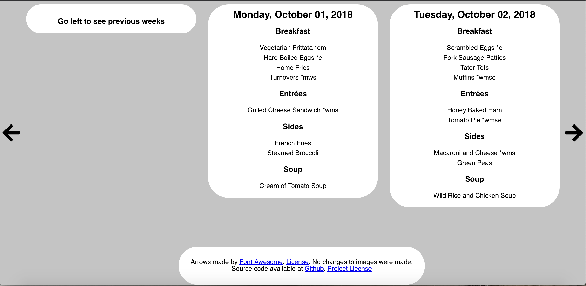
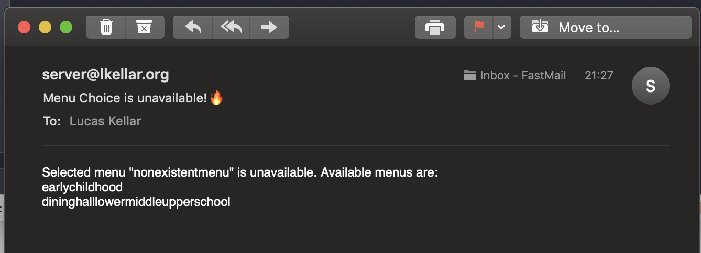

# mySchoolDining API
A Nifty API/Website for mySchoolDining

## About
This project is a Flask web server that fetches, caches, and serves data from MySchoolDining.

It presents its data to users via a simplified website. [See Website Section](#website)

It can also present data in pure JSON, for a whole week, for different dates, and even human readable text for serving directly to users [(See Siri Shortcut)](#shortcut)

## Installation

To install, clone the project, and install the requirements

This project requires Python 3.6 or higher.

`pipenv install`

Create a `config.json` in the project root directory that looks like the one below
```json
{
  "cache": "$HERE/cache.sqlite3",
  "school": "SCHOOL_NAME",
  "menu": "MENU_NAME"
}
```
A config needs to have
* A cache file location, this will be an sqlite3 database. If no database is present, one will be created. Use `$HERE` to represent the directory where the config is in.
* A school name, this is the `school_name` part of `https://myschooldining.com/school_name`
* A menu name, on MySchoolDining, there are different menu types sometimes. Identify the id of the desired menu. Example: The ones at [The New School](https://myschooldining.com/thenewschool) at the time of this writing are Dining Room (diningroom), Summer Camps (summercamps), and Preschool (preschool)

Then, just run Flask

```
export FLASK_APP=menu/app.py
flask run   
```

## Website
Instead of dealing with the mySchoolDining website, this project provides a nice simplified alternative.



Without any parameters, users will be presented with the days menu, and can easily browse the menu for the rest of the week.

Users can browse with the arrows on the site, the arrow keys, or the A and D keys.

Users can also view data from the current month, and one month in advance. 

## API Endpoints

#### `/api`
Returns menu for a specified date
##### Query Args
* `date` (Number | String): How many days in the future to fetch OR a date in the format yyyy-mm-dd to fetch.
* `wordify` (Boolean): Whether to make the text human readable (true), or JSON (false)

#### `/week`
Returns menu for current week in JSON
##### Query Args
* `weeks` (Number): How many weeks in the future to fetch

## Shortcut
Want to ask Siri for the menu? (iOS 12 only)

Download the Shortcut [here](https://www.icloud.com/shortcuts/7a5784c83c444a80b69bb04efc16a89d)

## Email
If your school has a tendency to change the menu ID unexpectedly, you can input email credentials to be notified of menu ID changes.

First, put some SMTP email credentials in your config, like the example below

```json
{
  "cache": "$HERE/menu.sqlite3",
  "school": "thenewschool",
  "menu": "upperschool",
  "email": {
    "server": "smtp.fastmail.com",
    "port": 465,
    "username": "lucas@lkellar.org",
    "password": "examplePassword",
    "to": "lucas@lkellar.org",
    "from": "server@lkellar.org"
  }
}
```

I would **STRONGLY** reccommend using an App-Specific Password for your email account. Some instructions on getting App-Specific passwords for common providers is listed below

*  [Apple/iCloud](https://support.apple.com/en-us/HT204397)
*  [Outlook/Hotmail/Any Microsoft](https://support.microsoft.com/en-us/help/12409/microsoft-account-app-passwords-and-two-step-verification)
*  [Gmail/Google](https://support.google.com/accounts/answer/185833?hl=en)
*  [FastMail](https://www.fastmail.com/help/clients/apppassword.html)

Once you've got your email information in the config, the application will automatically send emails to the provided address whenever the chosen menu can not be found.


